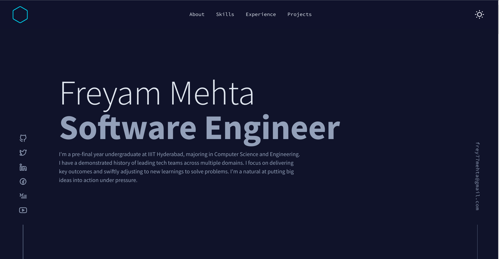

<h1 align="center">Freyam's Portfolio Website</h1>

 

 

 
 

Designed and built by [Brittiany Chang](https://brittanychiang.com/).

 
 

## Interface

 

 

 

 

<!--

`yarn` to install all the dependencies
`yarn dev` to run the development server (with hot reloading)
`yarn generate` to generate the static site before deploying on netlify

-->
